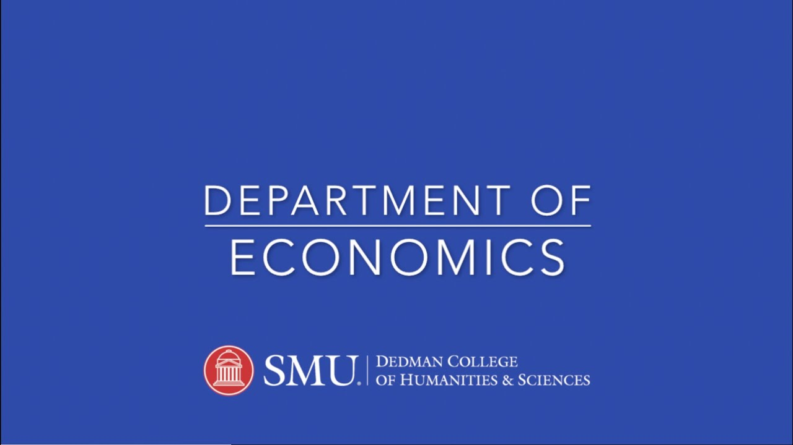

<!-- **kissikelvin/kissikelvin** is a ✨ _special_ ✨ repository because its `README.md` (this file) appears on your GitHub profile. -->

- 🔭 I’m currently working on [StrataMobileApp](https://github.com/kissikelvin/Strata-Mobile-App) 
- 🌱 I’m currently learning how to build IOS mobile apps & [DApps](https://ethereum.org/en/dapps/) on the Ethereum blockchain.
- 🤔 I’m looking for help building and designing cool Apps.
- 📫 How to reach me: [Info](https://kelvinkissi.io/)
- 😄 Pronouns: 'Kelvin Kissi'
- 👨🏾‍💻 Linkedin: [Linkedin](https://www.linkedin.com/in/kelvin-kissi/)
- ⚡ Fun fact: I strive to bring new technological solutions and make this emerging space easy for all of us to navigate.

  <a href="https://github.com/kissikelvin">
    
  </a>

  
<!--   -->
  
<!-- - 💬 Ask me about ... -->

